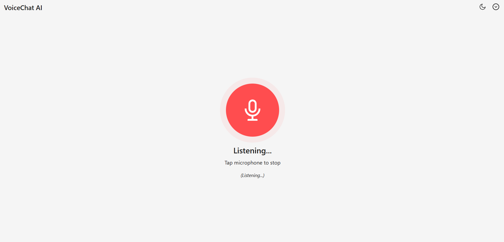
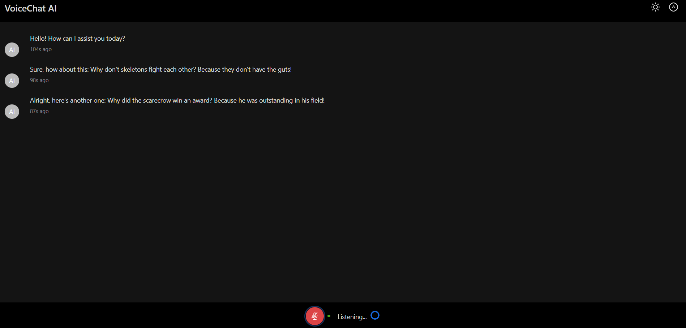

# VoiceChat AI Frontend 🎙️💬

This is the frontend application for a real-time, voice-to-voice AI chatbot. The app captures microphone audio, streams it to a backend service via WebSockets, receives text and audio responses from the AI, and plays back the AI's voice.

## Features ✨

- **Real-time Voice Input:** Captures audio from the user's microphone using the Web Audio API.
- **Audio Processing:** Downsamples audio to the target sample rate (24kHz) and converts it to 16-bit PCM format before sending.
- **WebSocket Communication:** Establishes a persistent WebSocket connection to the backend for sending user audio and receiving AI responses (events, text deltas, audio chunks).
- **Real-time AI Response:**
  - Displays partial transcriptions (`textDelta`) as the AI processes the response.
  - Streams and plays back AI audio chunks as they arrive.
- **Visual Feedback:** Provides clear UI indicators for connection status, recording state (user speaking), and AI speaking state.
- **Dual UI Modes:**
  - **Maximized View:** Default view with a large central microphone button for easy interaction.
  - **Minimized View:** Shows a chronological chat history.
- **Dark/Light Theme:** Toggle between dark and light modes, respecting user's system preference and saving the choice in localStorage.
- **Mobile Responsive:** Adapts the layout and component sizes for better usability on smaller screens.
- **Download Last Response:** Allows downloading the raw audio buffer of the AI's last complete spoken response as a `.wav` file.
- **Error Handling:** Displays status messages for connection issues, audio errors, and backend errors.
- **Auto-Reconnect:** Attempts to automatically reconnect the WebSocket if the connection drops unexpectedly.

### Screenshot:





## Tech Stack 💻

- **Framework:** React 19
- **Language:** TypeScript
- **Build Tool:** Vite
- **UI Library:** Ant Design 5.x
- **Audio:** Web Audio API (`AudioContext`, `MediaStream`, `ScriptProcessorNode` - _Note: `ScriptProcessorNode` is deprecated, consider `AudioWorklet` for future improvements_)
- **Communication:** WebSockets
- **State Management:** React Hooks (`useState`, `useRef`, `useCallback`, `useEffect`) + Custom Hooks

## Prerequisites

- Node.js (v18 or later recommended)
- npm, yarn, or pnpm
- A running instance of the corresponding **VoiceChat AI Backend** service.

## Setup & Running 🚀

1. **Clone the repository:**

   ```bash
   git clone https://github.com/Shreyas-Dayal/voice-chat-frontend
   cd voice-chat-frontend
   ```

2. **Install dependencies:**

   ```bash
   npm install
   # or
   yarn install
   # or
   pnpm install
   ```

3. **Configure Environment Variables:**
   Create a `.env` file in the project root directory. This file is used to configure the backend WebSocket URL.

   ```dotenv
   # .env
   VITE_BACKEND_WS_URL=ws://localhost:8080
   ```

   - Replace `ws://localhost:8080` with the actual URL where your backend WebSocket server is running.

4. **Ensure Backend is Running:** Start your VoiceChat AI backend service.

5. **Run the Frontend Development Server:**
   ```bash
   npm run dev
   # or
   yarn dev
   # or
   pnpm dev
   ```
   This will start the Vite development server, typically at `http://localhost:5173` (check your terminal output).

## Available Scripts

In the project directory, you can run:

- `npm run dev`: Runs the app in development mode with hot reloading.
- `npm run build`: Builds the app for production to the `dist` folder.
- `npm run lint`: Lints the codebase using ESLint.
- `npm run preview`: Serves the production build locally for previewing.

## How it Works (Simplified Flow)

1. **Connect:** The app attempts to initialize the `AudioContext` and establish a WebSocket connection to the backend specified by `VITE_BACKEND_WS_URL`.
2. **User Input:**
   - User clicks the microphone button (`MaximizedView` or `ControlBar`).
   - `useAudioRecorder` requests microphone access.
   - Audio chunks are captured, processed (downsampled, converted to PCM), and sent via WebSocket (`handleAudioData` -> `sendMessage`).
   - User clicks again to stop recording.
3. **Backend Processing:** The backend receives audio, performs Speech-to-Text (STT), processes the query with the AI model, and performs Text-to-Speech (TTS).
4. **AI Response:**
   - The backend sends events (`AIResponseStart`, `AIResponseEnd`), text deltas (`textDelta`), and audio chunks (binary `ArrayBuffer`) back via WebSocket.
   - `useServerEvents` (`handleWsMessage`) receives these messages.
   - `textDelta` updates the `currentUtterance` state (displayed in minimized view).
   - Audio chunks are buffered.
   - On `AIResponseEnd`, the buffered audio chunks are concatenated, the final text is added to the `messages` state, and `useAudioPlayer` (`playAudio`) is called to play the complete audio response.
5. **UI Updates:** Components react to state changes (`isRecording`, `isAISpeaking`, `isConnected`, `isConnecting`, `isAIReady`, `themeMode`, `isMobile`, etc.) to update their appearance and status indicators.

## Known Issues / Limitations

- **`ScriptProcessorNode`:** Uses the deprecated `ScriptProcessorNode` for audio capture. While functional, migrating to `AudioWorklet` is recommended for better performance and future compatibility, especially to avoid potential audio glitches under heavy load.
- **Error Handling:** Basic error messages are displayed. More granular error handling and user feedback could be implemented.

## Contributing

Contributions are welcome! Please feel free to open an issue or submit a pull request.
